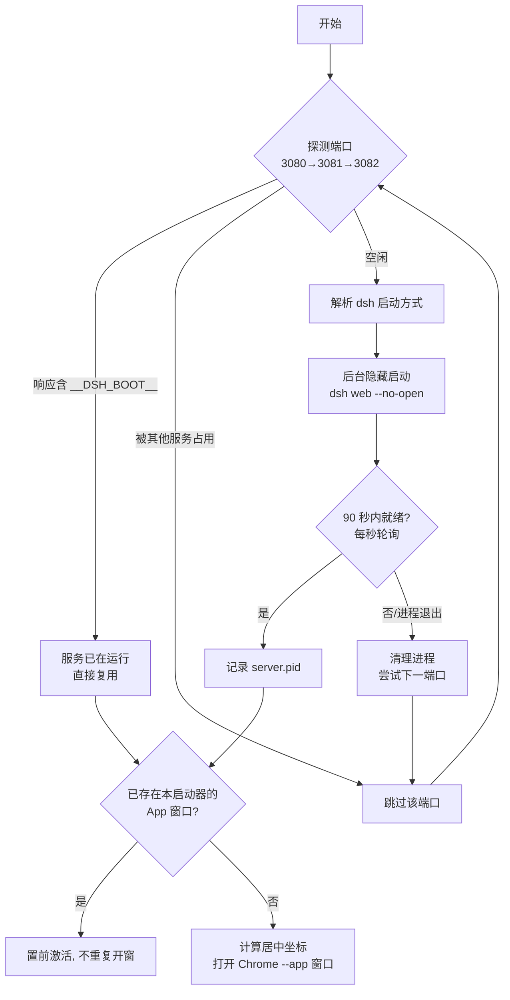
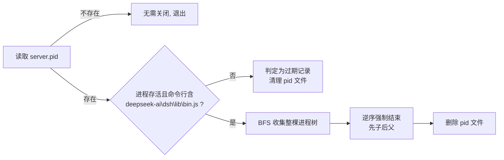

# DSH 桌面版 — 设计与操作文档

> **项目路径**：`dsh-desktop/`
> **文档版本**：v1.0
> **适用平台**：Windows 10/11（依赖 PowerShell 5.1+、Chrome 或 Edge）
> **一句话定位**：把 DSH Web GUI 包装成"原生桌面应用"体验的一键启动器 + 图标个性化工具集。

---

## 目录

- [1. 项目概述](#1-项目概述)
- [2. 文件架构](#2-文件架构)
- [3. 架构设计](#3-架构设计)
- [4. 操作指南](#4-操作指南)
- [5. 日志与故障排查](#5-日志与故障排查)
- [6. 恢复与卸载](#6-恢复与卸载)
- [7. 附录](#7-附录)

---

## 1. 项目概述

### 1.1 项目定位

DeepSeek Harness（DSH）的图形界面是一个运行在 `127.0.0.1:3080` 的 Web 服务。本项目通过 **Chrome/Edge 的 `--app` 独立窗口模式** 将其包装为无地址栏、无标签页、外观与桌面应用一致的窗口，并提供完整的生命周期管理与图标定制能力。

### 1.2 功能总览

| 功能 | 说明 | 入口 |
|---|---|---|
| 一键启动 | 探测服务 → 按需后台拉起 `dsh web` → 打开 App 窗口 | `DSH桌面版.bat` |
| 一键关闭 | 仅停止由本启动器拉起的服务进程树，绝不误杀 | `关闭DSH桌面版.bat` |
| 创建快捷方式 | 在桌面生成隐藏控制台的启动快捷方式 | `创建桌面快捷方式.bat` |
| 图标切换 | 桌面快捷方式图标与任务栏/窗口图标**可分别设置** | `切换DSH图标.bat` |

---

## 2. 文件架构

### 2.1 目录结构

```
dsh-desktop/
├── DSH桌面版.bat                  # 入口：一键启动（双击即用）
├── 关闭DSH桌面版.bat              # 入口：一键关闭
├── 创建桌面快捷方式.bat            # 入口：生成桌面快捷方式（一次性）
├── 切换DSH图标.bat                # 入口：交互式图标切换菜单
│
├── start-dsh-desktop.ps1          # 核心：启动器（探测/拉起服务/开窗）
├── stop-dsh-desktop.ps1           # 核心：停止器（安全结束服务进程树）
├── create-desktop-shortcut.ps1    # 核心：快捷方式创建
├── switch-dsh-icon.ps1            # 核心：双目标图标切换器
│
├── icons/                         # 图标库（用户资产，可自由增删）
│   ├── README.txt                 #   图标库使用说明
│   ├── deepseek-black.svg         #   候选图标：黑色鲸鱼
│   ├── deepseek-blue.svg          #   候选图标：蓝色鲸鱼
│   └── deepseek-diy.svg           #   候选图标：自定义款
│
├── dsh-icon-5a211dfd.ico          # 产物：当前生效的快捷方式图标（哈希命名）
└── active-icon.txt                # 状态：记录两处当前使用的图标名
```

### 2.2 文件职责矩阵

#### 入口层（.bat 薄封装）

统一模式：以 `%~dp0` 定位同目录脚本 → 隐藏/常规窗口调用 PowerShell → 避免用户直接接触命令行。

| 文件 | 调用目标 | 窗口行为 | 典型场景 |
|---|---|---|---|
| `DSH桌面版.bat` | `start-dsh-desktop.ps1` | 完全隐藏 | 日常启动 |
| `关闭DSH桌面版.bat` | `stop-dsh-desktop.ps1` | 显示 + pause | 用完关闭服务 |
| `创建桌面快捷方式.bat` | `create-desktop-shortcut.ps1` | 显示 + pause | 初始化时执行一次 |
| `切换DSH图标.bat` | `switch-dsh-icon.ps1` | 显示 + pause | 更换图标 |

#### 核心逻辑层（PowerShell）

| 脚本 | 行数 | 核心职责 |
|---|---|---|
| `start-dsh-desktop.ps1` | ~207 | 端口探测、dsh 启动方式解析、服务就绪等待、浏览器定位、App 窗口管理 |
| `stop-dsh-desktop.ps1` | ~37 | PID 记录校验、进程树收集、逆序安全终止 |
| `create-desktop-shortcut.ps1` | ~49 | 快捷方式创建与图标解析（幂等） |
| `switch-dsh-icon.ps1` | ~411 | SVG 渲染、多尺寸 ICO 生成、favicon 替换、状态管理、缓存刷新 |

### 2.3 运行时产物（不在本目录）

| 路径 | 内容 | 产生者 |
|---|---|---|
| `%LOCALAPPDATA%\DSHDesktop\start.log` | 启动器主日志 | start |
| `%LOCALAPPDATA%\DSHDesktop\server.pid` | 由本启动器拉起的服务 PID | start |
| `%LOCALAPPDATA%\DSHDesktop\server-<port>.out.log / .err.log` | dsh web 进程 stdout/stderr | start |
| `%LOCALAPPDATA%\DSHDesktop\ChromeProfile\` | Chrome 独立用户配置（隔离，不污染日常浏览器） | start |
| `<dsh-web-frontend>/dist/favicon.svg.orig` 等 3 个 `.orig` 备份 | 前端原始文件备份（供 `-Restore` 回滚） | switch |

---

## 3. 架构设计

### 3.1 总体分层

```
┌─────────────────────────────────────────────────────────┐
│  用户层        双击 .bat / 桌面快捷方式                    │
├─────────────────────────────────────────────────────────┤
│  入口层        DSH桌面版.bat │ 关闭.bat │ 图标.bat │ ...   │
├─────────────────────────────────────────────────────────┤
│  核心逻辑层     start ─┐                                   │
│                stop  ─┤  相互协作：                        │
│                shortcut┤  · shortcut/switch 生成并维护      │
│                switch ─┘    桌面 .lnk 与其图标              │
│                          · switch 改完窗口图标后调用        │
│                            start 重启 App 窗口             │
├─────────────────────────────────────────────────────────┤
│  外部依赖       dsh CLI (web --no-open)                   │
│                Chrome/Edge (--app 独立窗口)               │
│                dsh-web-frontend/dist (favicon 替换目标)    │
├─────────────────────────────────────────────────────────┤
│  状态与产物     active-icon.txt │ server.pid │ *.log       │
└─────────────────────────────────────────────────────────┘
```

### 3.2 启动流程（start-dsh-desktop.ps1)



**关键机制说明：**

- **端口探测协议**：对 `http://127.0.0.1:<port>` 发 GET，响应内容含 `__DSH_BOOT__` 即认定为 DSH 服务（区别于被其他程序占用的端口）。
- **dsh 启动方式解析**（避免 PATH 失效导致无法启动）：
  1. PATH 中找到 `dsh` → 若为 `.ps1` 垫片（npm/nvmd 风格），改用同目录 `node.exe + node_modules/@deepseek-ai/dsh/lib/bin.js` 直启；
  2. 若为 `.cmd/.exe/.bat` 直接使用；
  3. 兜底回退 `%USERPROFILE%\.nvmd\bin\dsh.cmd`。
- **单实例语义**：通过检测 Chrome 命令行中 `--user-data-dir=<ProfileDir>` + `--app=` 特征判断窗口是否已存在，存在则 `AppActivate` 置前而非重复开窗。
- **错误反馈**：优先 WinForms 弹窗（双击场景无控制台），兜底控制台输出。

### 3.3 停止流程（stop-dsh-desktop.ps1）



> **设计要点**：PID 文件 + 命令行指纹双重校验。即使 PID 被系统复用给了别的进程，也绝不会误杀——只有命令行匹配 `deepseek-ai/dsh/lib/bin.js` 的进程才会被终止。

### 3.4 图标切换流程（switch-dsh-icon.ps1）

本脚本管理**两个互相独立的图标目标**：

| 目标 | 技术路径 | 生效方式 |
|---|---|---|
| ① 桌面快捷方式图标 | 源图 → 统一渲染为 256px PNG → 合成 16/32/48/256 四尺寸 `.ico` → 按**内容 SHA-256 前 8 位**命名为 `dsh-icon-<hash>.ico` → 重写 `.lnk` 的 IconLocation | `ie4uinit -show` + `SHChangeNotify` 温和刷新资源管理器图标缓存（不重启 explorer） |
| ② 任务栏/独立窗口图标 | 定位 `dsh-web-frontend/dist` → 首次备份 `favicon.svg` / `index.html` / `manifest.webmanifest` 为 `.orig` → SVG 直接替换 favicon；PNG/ICO 则转 PNG 并同步改写 HTML `<link>` 与 manifest 引用 | 杀掉现有 App 窗口后由启动器重新拉起加载新 favicon |

**源图处理管线：**

```
.svg  ──► 规范化根标签(width/height=256, 补 xmlns) ──► Chrome headless --screenshot (256×256 透明底)
.png  ──► 直接使用(建议 ≥256px)
.ico  ──► System.Drawing 取最大帧转 256px PNG
        │
        ▼
  New-MultiSizeIco: 手工构造 ICO 容器(PNG 帧: 16/32/48 缩放 + 256 原图) ──► dsh-icon-<hash8>.ico
```

**为什么按内容哈希命名 ico？**
Windows 资源管理器对「同路径同名」的图标文件有强缓存。内容变化时哈希名随之变化，等于每次都给系统一个全新文件路径，从根源上绕过缓存失效问题。

### 3.5 状态与数据管理

`active-icon.txt` 采用 v2 两行格式：

```
shortcut=deepseek-diy      ← 桌面快捷方式当前图标名
taskbar=deepseek-black     ← 任务栏当前图标名
```

- 写入使用 `[System.IO.File]::WriteAllLines` 保证两行各占一行；
- 读取兼容 v1 单行旧格式（首行无 `=` 时视为两处共用）。

### 3.6 关键设计决策

| # | 决策 | 动机 |
|---|---|---|
| 1 | Chrome `--app` 模式而非 Electron 封装 | 零打包成本，自动继承浏览器的渲染/网络能力与更新 |
| 2 | 独立 `--user-data-dir` 配置目录 | 与日常浏览器完全隔离，不共享 Cookie/扩展，可放心定制 |
| 3 | 服务按需启动 + 就绪复用 | 已有 DSH 运行时不重复拉起；端口被占用时自动顺延下一端口 |
| 4 | PID + 命令行双重校验后才 kill | 保证「只关自己拉起的」，多实例共存场景零误伤 |
| 5 | dist 三件套 `.orig` 备份 | 任何图标修改均可一键回滚出厂；dsh 升级覆盖 dist 后可用 `-Reapply` 重放 |
| 6 | 内容哈希命名 ico + SHChangeNotify | 双保险规避 Windows 图标缓存 |
| 7 | 全程日志落盘 `%LOCALAPPDATA%\DSHDesktop` | 无控制台运行时问题仍可追溯 |

---

## 4. 操作指南

### 4.1 快速开始（三步上手）

```
① 双击「创建桌面快捷方式.bat」      —— 仅首次执行，生成桌面图标
② 双击「DSH桌面版.bat」（或桌面图标） —— 启动 DSH 桌面版
③ 用完后双击「关闭DSH桌面版.bat」    —— 停止后台服务
```

### 4.2 启动器参数参考（start-dsh-desktop.ps1）

所有参数均可省略；命令行进阶用法示例：

```powershell
powershell -NoProfile -ExecutionPolicy Bypass -File start-dsh-desktop.ps1 `
    -Ports 3080,3081 -Width 1600 -Height 1000

# 指定浏览器 + 最大化启动
powershell ... -File start-dsh-desktop.ps1 -ChromePath "D:\tools\chrome.exe" -Maximized
```

| 参数 | 默认值 | 说明 |
|---|---|---|
| `-Ports` | `3080,3081,3082` | 依次探测/尝试的端口序列 |
| `-ChromePath` | 自动查找 | 指定浏览器可执行文件（Chrome 优先，Edge 兜底） |
| `-Width` / `-Height` | `1440` / `900` | App 窗口尺寸（自动屏幕居中） |
| `-Maximized` | 关 | 以最大化方式打开窗口 |
| `-LogDir` | `%LOCALAPPDATA%\DSHDesktop` | 日志与 PID 文件目录 |
| `-ProfileDir` | `<LogDir>\ChromeProfile` | Chrome 独立用户配置目录 |
| `-WorkingDir` | `%USERPROFILE%` | dsh web 服务的工作目录（会话工作区根） |

### 4.3 图标切换操作手册（switch-dsh-icon.ps1）

**准备图标**：把任意 `.svg` / `.png` / `.ico` 丢进 `icons\` 目录即可，文件名即菜单显示名（推荐 svg，或 ≥256px 的 png）。svg 支持渐变/滤镜/圆角底板等任意复杂度，根标签需带 `viewBox`。

**四种使用方式：**

```text
① 双击「切换DSH图标.bat」           —— 交互式菜单：选图标 → 选应用目标
② .\switch-dsh-icon.ps1 -Name xxx   —— 两处一起换（兼容旧用法）
③ .\switch-dsh-icon.ps1 -Shortcut xxx   —— 只换桌面快捷方式图标
④ .\switch-dsh-icon.ps1 -Taskbar xxx    —— 只换任务栏/窗口图标
```

交互式菜单中应用目标的含义：

| 选项 | 作用范围 | 是否重启窗口 |
|---|---|---|
| `1`（默认） | 桌面 + 任务栏 | 是 |
| `2` | 仅桌面快捷方式 | 否（即时生效） |
| `3` | 仅任务栏/窗口 | 是 |

**维护类参数：**

| 参数 | 场景 | 说明 |
|---|---|---|
| `-Reapply` | **dsh 升级后** | 升级会还原前端 dist，此命令按 `active-icon.txt` 记录重新应用两处图标 |
| `-Restore` | 想换回原样 | 恢复出厂 favicon 三件套、删除状态记录、快捷方式指回浏览器图标，并重启窗口 |
| `-Name <路径>` | 临时图片 | 直接指定任意 svg/png/ico 文件路径，无需放入 icons 库 |

**典型工作流：**

```text
日常换图标:   双击 bat → 输入编号 → 选 1 → 完成
升级后失效:   .\switch-dsh-icon.ps1 -Reapply
彻底还原:     .\switch-dsh-icon.ps1 -Restore
```

---

## 5. 日志与故障排查

### 5.1 日志位置

| 日志 | 路径 | 内容 |
|---|---|---|
| 启动器主日志 | `%LOCALAPPDATA%\DSHDesktop\start.log` | 探测/启动/开窗全过程时间线 |
| 服务输出 | `%LOCALAPPDATA%\DSHDesktop\server-<port>.out.log` | dsh web stdout |
| 服务错误 | `%LOCALAPPDATA%\DSHDesktop\server-<port>.err.log` | dsh web stderr |

### 5.2 常见问题速查

| 现象 | 可能原因 | 处理方法 |
|---|---|---|
| 弹窗「找不到 dsh 命令」 | 未安装 DeepSeek Harness 或不在 PATH | 先安装 dsh 并确认 `dsh --help` 可用；或检查 `%USERPROFILE%\.nvmd\bin\dsh.cmd` 是否存在 |
| 弹窗「无法启动 DSH Web 服务」 | 服务启动超时/崩溃 | 查看 `start.log` 与 `server-*.err.log` 定位 |
| 三个端口都提示被占用 | 其他程序占用 3080–3082 | 用 `-Ports` 换端口，或排查占用进程 |
| 弹窗「找不到 Chrome / Edge」 | 浏览器安装在非标准路径 | 加 `-ChromePath "C:\...\chrome.exe"` 指定 |
| 窗口没弹出来但日志说成功 | 已有 App 窗口在后台 | 在任务栏找已有窗口（启动器只会置前不会重复开窗） |
| 「关闭DSH桌面版」提示无需关闭 | 服务不是由本启动器拉起的 | 属正常保护逻辑；如需停止请自行结束对应 `dsh web` 进程 |
| 换了图标但桌面没变 | 资源管理器图标缓存延迟 | 等待片刻，或注销/重启资源管理器；脚本已内置 ie4uinit + SHChangeNotify 刷新 |
| dsh 升级后任务栏图标变回原样 | 升级覆盖了前端 dist | 执行 `.\switch-dsh-icon.ps1 -Reapply` |
| SVG 渲染失败报缺 viewBox | svg 根标签缺少 viewBox | 在 `<svg>` 根标签补 `viewBox="0 0 24 24"` 之类声明 |

---

## 6. 恢复与卸载

**恢复出厂图标**

```powershell
.\switch-dsh-icon.ps1 -Restore
```

自动完成：还原 dist 三件套 → 删除注入的 favicon.png → 快捷方式图标指回浏览器默认 → 清除状态记录 → 重启窗口。

**完整卸载步骤**

1. 双击 `关闭DSH桌面版.bat` 停止后台服务；
2. 删除桌面 `DSH 桌面版.lnk`；
3. 删除整个 `dsh-desktop\` 目录；
4. （可选）删除运行时数据：`%LOCALAPPDATA%\DSHDesktop\`。

> 注意：若曾切换过任务栏图标且未 `-Restore`，请先执行恢复再删除目录，否则前端将保持自定义 favicon 直到下次 dsh 升级覆盖 dist。

---

## 7. 附录

### 7.1 依赖环境清单

| 依赖 | 用途 | 缺失影响 |
|---|---|---|
| DeepSeek Harness（`dsh` CLI） | 提供 Web 服务本体 | 无法启动 |
| Node.js | dsh 运行时（经 nvmd/npm 垫片间接解析） | 无法启动 |
| Chrome 或 Edge | App 窗口容器 + SVG headless 渲染 | 无法启动 / 无法渲染 svg 图标 |
| PowerShell 5.1+ | 全部核心脚本 | —（Windows 自带） |
| .NET System.Drawing | ICO/PNG 图像处理 | 图标切换不可用（系统自带） |

### 7.2 当前状态快照

| 项目 | 值 |
|---|---|
| 桌面快捷方式图标 | `deepseek-diy` |
| 任务栏/窗口图标 | `deepseek-black` |
| 图标库成员 | `deepseek-black` · `deepseek-blue` · `deepseek-diy` |
| 当前快捷方式图标文件 | `dsh-icon-5a211dfd.ico` |

### 7.3 维护备注

- `icons\` 目录为用户自由区，增删图标无需改动任何脚本，切换器自动枚举；
- `dsh-icon-*.ico` 为生成产物，每次更换桌面图标时旧哈希文件会被自动清理，勿手工引用；
- `active-icon.txt` 请保持 v2 两行格式（`shortcut=` / `taskbar=` 各占一行），异常时可删除该文件后重新切换一次即可重建。
